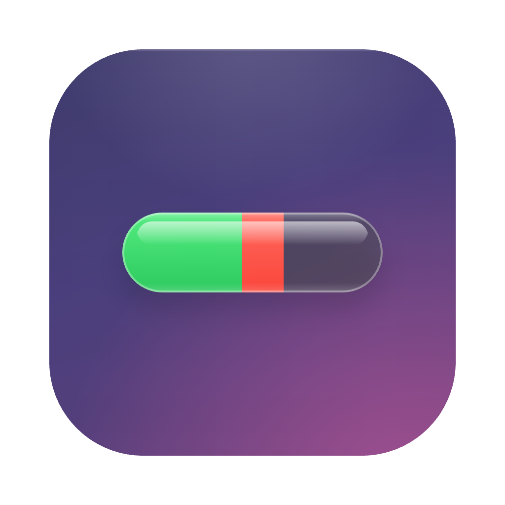
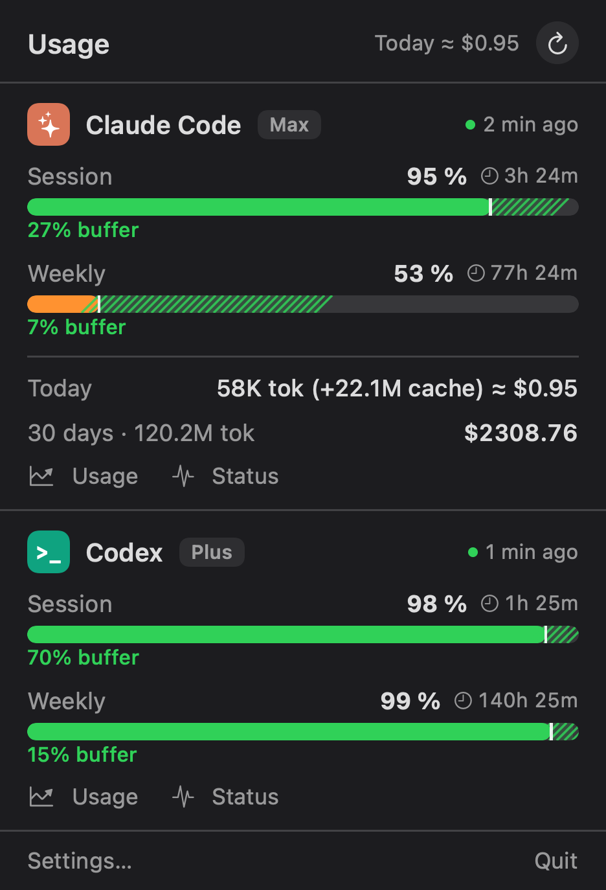
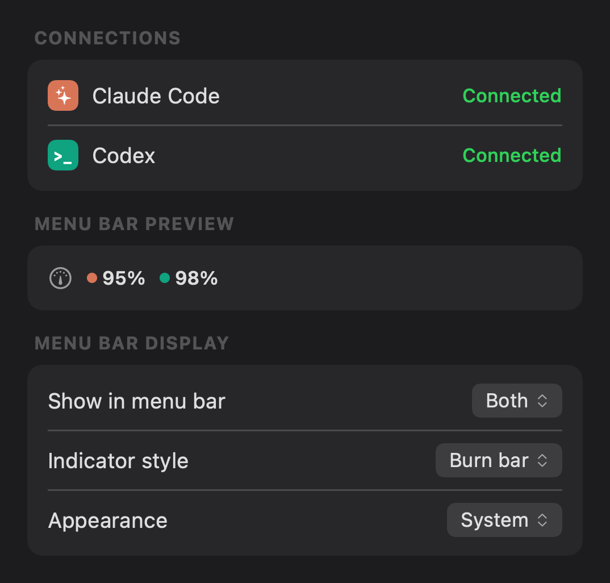

<p align="center">
  
</p>

# AgentBar

> Native macOS menu bar app that tracks your Claude Code & Codex usage and limits — at a glance.

[](https://github.com/Rivalio-s-r-o/AgentBar/actions/workflows/ci.yml)
[](LICENSE)

<p align="center">
  
  &nbsp;&nbsp;
  
</p>

## What is it

AgentBar lives in your macOS menu bar and shows how much of your Claude Code and
Codex (ChatGPT) usage limits you have left, when each window resets, and where
your current burn rate is heading — so a limit never surprises you mid-session.

It is a **companion** to the official Claude Code and Codex CLIs: it reads the
usage data they already store on your Mac. It has no login of its own and never
asks for your password.

## Features

- **Live limits** for Claude Code (5-hour session + weekly) and Codex (session +
  weekly), with reset countdowns.
- **Burn-rate projection** — a two-tone bar shows what's safely left vs. what
  your current pace will consume before reset, plus a "limit in ~Xh" warning when
  you're on track to run out early.
- **Pace at a glance** — `27% buffer` (ahead) or `12% over` (burning fast) per
  window.
- **Today's cost** and a rolling **30-day** token + dollar estimate.
- **Adaptive providers** — shows only the tools you've connected, with a small
  "not connected" hint for the rest so you know what's supported.
- **Configurable menu bar** — pick the indicator style (dot + %, label, burn
  bar…), which providers to show, and which window to watch.
- **Opt-in alerts** when a remaining limit drops below a threshold.
- **Battery-friendly** — uses `NSBackgroundActivityScheduler` and pauses while
  the display sleeps.
- **Localized** (English / Czech), with System / Light / Dark appearance.

## Requirements

- **macOS 14** (Sonoma) or later.
- At least one of:
  - **[Claude Code](https://claude.ai/code)** installed and signed in (run it
    once, then `/usage`), and/or
  - **Codex** CLI installed and signed in (run `codex` once).
- To build from source: **Xcode 16** (Swift 6).

## Install (build from source)

AgentBar is distributed as source — building it yourself takes about half a
minute:

```bash
git clone https://github.com/Rivalio-s-r-o/AgentBar.git
cd AgentBar

# Optional: create a stable self-signed cert so the macOS Keychain won't
# re-prompt after every rebuild (asks for your login password once):
./scripts/setup-signing.sh

# Build the .app (release):
./scripts/make-app.sh

# Move it into place and launch:
mv AgentBar.app /Applications/
open /Applications/AgentBar.app
```

## How it works & privacy

AgentBar is intentionally minimal about what it touches:

- It **reads** `~/.claude` and `~/.codex` **read-only** — the same files the
  official CLIs write. It never touches your conversations or settings.
- It has **no login of its own.** Authentication is whatever you already did in
  Claude Code / Codex. To "connect" a provider, just sign in to its CLI.
- **OAuth tokens stay in memory only.** They are never logged, never written
  anywhere else, never sent to any third party. The only network calls go
  directly to Anthropic's and OpenAI's own usage endpoints (and anonymously to
  GitHub for the update check).
- The single exception to read-only is a **controlled token refresh**: if a
  token has expired, AgentBar refreshes it and writes it back to the original
  store (Keychain / `auth.json`), guarded by round-trip validation and written
  atomically — the same thing the CLIs themselves do.

## macOS permissions

AgentBar asks for as little as possible. Here's what it may request, and why:

**Keychain (Claude only).** To fetch your live Claude limits, AgentBar reads the
Claude Code OAuth token from your login Keychain (the `Claude Code-credentials`
item that Claude Code created). The first time, macOS shows a Keychain prompt —
click **Always Allow** so it doesn't ask again.

- Build with `./scripts/setup-signing.sh` first so "Always Allow" survives
  rebuilds. (With an ad-hoc signature the prompt returns after every rebuild.)
- Running `/login` in Claude Code rewrites that item and resets its access list,
  so expect the prompt once more after each re-login. That's normal.
- Codex needs **no** Keychain access — its token is a plain file
  (`~/.codex/auth.json`).

**Notifications (optional).** Only if you enable low-limit alerts
(Settings → Alerts). Revoke anytime in System Settings → Notifications.

**Login item (optional).** Only if you enable "Launch at login"; adds AgentBar
to System Settings → General → Login Items.

**What it does _not_ need:**

- **No Full Disk Access** — it only reads `~/.claude` and `~/.codex`, dotfiles in
  your home folder (not TCC-protected locations like Documents or Desktop).
- **No Gatekeeper "unidentified developer" warning** — because you build the app
  yourself, macOS doesn't quarantine it.
- No accessibility, screen-recording, camera, or microphone access.

## Settings

Open the popover → **Settings…**:

- **Connections** — which providers are connected, with a short how-to for the
  rest.
- **Menu bar display** — indicator style, which providers to show, which window
  to watch, remaining vs. used %.
- **Appearance** — System / Light / Dark.
- **Alerts** — opt-in low-limit notifications and threshold.
- **Updates** — automatic check against the latest GitHub release (notify-only).

## Troubleshooting

- **The menu bar shows a neutral gauge icon / "not connected":** run and sign in
  to Claude Code (then `/usage`) and/or Codex (`codex`) — AgentBar reads their
  data.
- **macOS keeps asking for the Keychain:** click *Always Allow*; build via
  `./scripts/setup-signing.sh` so it persists across rebuilds; avoid unnecessary
  `/login` in Claude Code.
- **"Data is N minutes old":** AgentBar throttles live requests and backs off
  after rate limits — it refreshes shortly on its own.

## Contributing

See [CONTRIBUTING.md](CONTRIBUTING.md). Issues and pull requests are welcome.

## License

[MIT](LICENSE) © 2026 Rivalio s.r.o.
